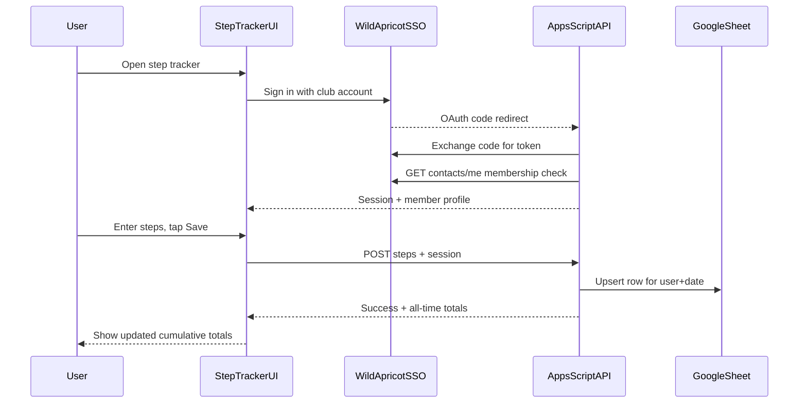
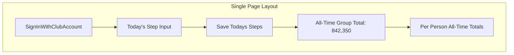
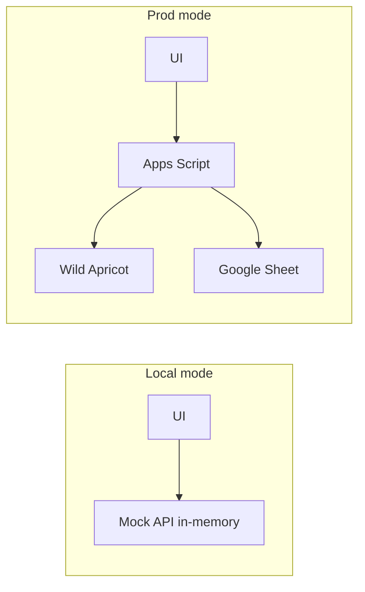
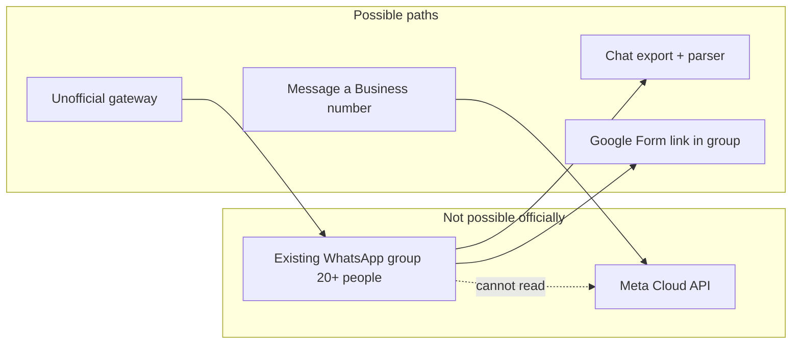
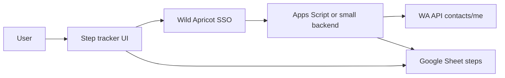

# Step Counter Website Plan

## Recommendation

Use **Wild Apricot SSO + Google Apps Script + Google Sheets** (+ a simple UI on GitHub Pages or linked from the club site). Members sign in with their existing club account; steps live in a Sheet; Apps Script is the free backend.

**Why Wild Apricot SSO?** The club already uses WA. Members have credentials; membership status replaces a separate allowlist; no Google/WhatsApp auth to invent.

**Why still need Apps Script?** Wild Apricot does **not** offer server-side code hosting (no PHP/Node/Python on WA servers). It only allows **client-side JavaScript** in Custom HTML gadgets / Global JavaScript. WA OAuth requires a server to exchange the auth `code` for a token (client secret must not live in the browser), and writing to Sheets securely also needs a backend. **Google Apps Script** fills that gap at $0.



### Cost

| Component | Cost |
|-----------|------|
| Wild Apricot SSO / API | $0 extra (club already pays for WA) |
| Google Sheets storage | $0 |
| Google Apps Script API | $0 (within generous daily quotas) |
| GitHub Pages hosting (optional) | $0 |
| Custom domain (optional) | $0–$12/yr if you want one |

---

## Data Model

One Google Sheet with a tab named `steps`:

| date | contactId | email | name | steps | updated_at |
|------|-----------|-------|------|-------|------------|

- **One row per person per day** — saving again the same day updates that row (upsert).
- Identity comes from Wild Apricot (`contactId` + email/name from `/contacts/me`).
- **No allowlist tab** — an active WA membership is the gate.

---

## Authentication (preferred: Wild Apricot SSO)

### Preferred flow

1. User clicks **“Sign in with club account”**
2. Redirect to WA: `https://<club>.wildapricot.org/sys/login/OAuthLogin?...`
3. After login, WA redirects to Apps Script with an authorization `code`
4. Apps Script exchanges `code` + **client secret** for an access token
5. Apps Script calls `GET /v2/accounts/{accountId}/contacts/me` and checks membership is active
6. Apps Script issues a short-lived session cookie/token for the UI
7. Save-step requests require that session; identity is never taken from the browser alone

Club admin one-time setup: **Settings → Apps → Authorized applications → Server application**, enable “Authorize users via Wild Apricot single sign-on”, set trusted redirect domain to the Apps Script web-app URL. Store Client ID / Secret / Account ID in **Apps Script Script Properties** (never in frontend).

### Does Wild Apricot offer server-side code?

**No.** Official stance and community confirmation:

- WA cannot host PHP or other server-side runtimes on club pages
- Custom code on WA is **browser JavaScript only** (Custom HTML gadget, Global JavaScript)
- Same-origin JS on a WA page can call the **Member API** as the logged-in user (e.g. `/contacts/me`), but cannot safely hold API secrets or act as a secure write backend for Google Sheets
- For SSO token exchange and Sheet writes, you need an **external** backend — Apps Script, Cloudflare Worker, etc.

**Implication:** WA owns identity; Apps Script owns the secure API. Hosting the UI on a WA members-only page is optional and does not remove the need for Apps Script.

### Other auth options (not preferred)

| Approach | Notes |
|----------|-------|
| Google OAuth | Fallback if WA SSO access is unavailable |
| WhatsApp OTP | Expensive/heavy; no one-click web login |
| Shared PIN | Weak; avoid for 20+ users |

---

## Backend: Google Apps Script

A single [`Code.gs`](Code.gs) deployed as a **Web App**:

- `GET /auth/callback` — WA OAuth redirect handler; exchange code; create session
- `POST /log` — require session; upsert **today’s** steps for that member
- `GET /totals` — return **all-time cumulative totals** (group + per person)
- `GET /me` — return current member profile + today’s steps if any

Key logic:
- Verify session server-side; load WA contact id/email/name
- Reject non-active members
- Upsert row for `(date, contactId)`
- Sum all rows for totals: `{ totalSteps, contributors: [{ name, steps }] }`

Deploy settings: **Execute as: Me**, **Who has access: Anyone** (session + WA membership provide authorization). Client secret stays in Script Properties.

---

## Frontend: Single-page app

Plain **HTML + CSS + vanilla JS**. Prefer a small module layout so domain logic is unit-testable. Host on **GitHub Pages** and/or link from a Wild Apricot members page.

| File | Purpose |
|------|---------|
| [`index.html`](index.html) | Page structure |
| [`styles.css`](styles.css) | Clean mobile-first layout |
| [`src/app.js`](src/app.js) | UI wiring: auth redirect, API calls, DOM updates |
| [`src/api.js`](src/api.js) | API client — real vs mock implementation via config |
| [`src/domain/`](src/domain/) | Pure logic: upsert, totals aggregation, step validation, session helpers |
| [`config.js`](config.js) | `MODE` (`local` \| `prod`), Apps Script URL, WA site URL (no secrets) |

### UX

**Input is daily; display is all-time cumulative.**

1. **Not signed in:** “Sign in with club account”
2. **Signed in:** large numeric input pre-filled with **today’s** value if already logged
3. **Primary action:** “Save today’s steps”
4. **Hero:** **Total steps (all time): 842,350**
5. **Per-person list:** cumulative totals, sorted highest first
6. Signed-in name + “Sign out”



---

## Local testing (mock all external calls)

Before any WA / Sheets / Apps Script deployment, ship a **locally testable mode** that exercises the full UI and business flow with **zero external network calls**.

### Requirements

- `config.js` (or env flag) sets `MODE = 'local'` vs `'prod'`
- In `local` mode, the API client uses an in-memory mock backend — no Wild Apricot, no Google Sheets, no Apps Script
- Mocked operations must cover at least:
  - **Auth / login** — fake “Sign in as Mock Member” (and optionally a second mock user)
  - **Membership gate** — reject a mock “inactive” member
  - **Upsert today’s steps** — create/update in-memory row for `(date, contactId)`
  - **Totals** — return all-time group + per-person cumulative sums
  - **GET /me** — current mock profile + today’s steps
  - **Sign out** — clear session
- Seed data: a few fake members with multi-day history so the leaderboard is meaningful immediately
- Persist mock data in `localStorage` (optional) so a local session survives refresh during manual testing
- Run with a static server (`npx serve`, Live Server, etc.) — no WA admin access needed for day-to-day UI work



### Design rule

Keep **domain logic pure** (upsert, aggregate totals, validate step counts, membership decision) in modules that accept data in / data out. Both the mock API and the Apps Script path should call the same logic (or a close JS copy) so local tests match production behavior.

---

## Unit tests

All functionality should ship with **unit tests where possible**. Prefer testing pure logic; thin DOM/glue code can stay lightly covered or covered via the local mock manual path.

### Scope (required where feasible)

| Area | Examples |
|------|----------|
| Step validation | Reject non-integers, negatives, absurd values; accept sensible range |
| Upsert | Insert new day row; update same day; leave other days/users untouched |
| Totals aggregation | All-time group sum; per-person sums; sort order; empty sheet |
| Membership / auth rules | Active member allowed; inactive rejected; missing session rejected |
| Date helpers | “Today” keying for upsert; timezone convention documented and tested |
| API client (mock) | Local mock returns expected shapes for login / log / totals / me |
| UI helpers | Format numbers; map API response → display model |

### Tooling (lightweight)

- **Vitest** (or Node’s built-in test runner) for `src/domain/` and mock API
- `npm test` as the single entry point
- No requirement for full browser E2E in v1; local mock mode covers interactive smoke testing
- Apps Script–specific wrappers can stay thin; test the shared JS logic thoroughly before deploy

### Definition of done for testing

1. `npm test` passes with no external network
2. Local mock mode can complete: sign in → save steps → see updated totals → sign out
3. Core domain modules have unit coverage for happy path + edge cases listed above

---

## Setup (one-time)

1. Create Google Sheet with `steps` tab
2. In Wild Apricot: create Authorized Application (SSO), note Account ID / Client ID / Client Secret
3. Implement domain logic + unit tests + local mock mode; verify with `npm test` and local UI
4. Deploy Apps Script web app; store WA secrets in Script Properties; set redirect URI to match
5. Point frontend `MODE = 'prod'` at Apps Script URL
6. Link from club WA site (members area) and/or enable GitHub Pages
7. Smoke test with a real member account on mobile

---

## Repository structure

```
stepcounter/
├── index.html
├── styles.css
├── config.js / config.example.js
├── src/
│   ├── app.js
│   ├── api.js              # real vs mock switch
│   ├── api.mock.js         # in-memory auth + upsert + totals
│   └── domain/             # pure, unit-tested logic
├── tests/                  # unit tests (vitest or node:test)
├── apps-script/            # Code.gs for OAuth + Sheet API
├── package.json            # test scripts
└── README.md               # local mock, tests, WA + Apps Script setup
```

---

## Alternative: Supabase (if Sheets feels too hacky)

If you later want a more “proper” backend, **Supabase free tier** can store steps and still use WA SSO via a small OAuth bridge. More setup than Sheets + Apps Script.

For this project’s goals, **Sheets + Apps Script remains the starting point**; only the auth provider is Wild Apricot.

---

## Security notes

- WA client secret and session signing key live only in Apps Script Script Properties
- Membership checked server-side — browser cannot spoof another member
- Apps Script URL is public but useless without a valid WA-backed session
- Do **not** put Client Secret in frontend or in WA page JavaScript

---

## Implementation order

1. Scaffold repo: domain modules, mock API, frontend shell, test runner
2. Implement + unit-test upsert, totals, validation, membership rules
3. Wire local mock mode; manually verify full UI flow with no external calls
4. Create Google Sheet `steps` tab
5. Create WA Authorized Application (SSO)
6. Implement Apps Script adapters (OAuth callback + Sheet I/O) on top of shared logic
7. Switch frontend to prod mode; link from WA / deploy GitHub Pages
8. End-to-end test with a real member on mobile

---

## Alternative B: WhatsApp Group Input → Google Sheets

If participants prefer logging steps in a **shared WhatsApp chat** instead of a web app, the goal (daily input → cumulative totals in a sheet) stays the same but the ingestion path changes.

### Critical constraint: regular WhatsApp groups are not API-readable

Meta’s **official WhatsApp Business Cloud API cannot read messages from normal consumer group chats** — the kind created in the regular WhatsApp app. This rules out fully automatic sync from your existing group using only official, free Meta tools.

Meta’s newer **Groups API** is different: it creates API-managed groups (invite-only, **max 8 participants**, requires Official Business Account or very high messaging volume, per-message fees). It does **not** work with an existing 20+ person consumer group.



### Option comparison

| Approach | Automation level | Cost | Setup | Fits 20+ group? | Recommended? |
|----------|------------------|------|-------|-----------------|--------------|
| **A. Chat export + parser** | Semi-auto (admin exports periodically) | Free | Low–medium | Yes | Best if group chat must stay |
| **B. Google Form link pinned in group** | Auto to Sheet on submit | Free | Very low | Yes | Best overall for zero-cost + reliability |
| **C. DM a WhatsApp Business bot** | Fully auto via webhook | Per-message fees + API setup | High | Yes (but not in group) | Good if 1:1 messaging is OK |
| **D. Unofficial gateway (Evolution API, Baileys)** | Fully auto from group | Server cost; **ToS violation; ban risk** | High | Yes | Not recommended |

---

### Option A: Chat export + parser (semi-automatic)

**How it works**

1. Agree on a **message format** in the group, e.g. just a number (`8432`) or `8432 steps`
2. Once per day (or week), an admin **exports the chat** on their phone: Chat → ⋮ → Export chat → Without media
3. Upload the exported `_chat.txt` (or ZIP) to a small **parser tool** that:
   - Parses sender name, timestamp, and message text
   - Extracts numeric step counts per person per day
   - Upserts rows into the Google Sheet (`date`, `name`, `steps`)
4. A **dashboard tab** in the same Sheet (or the GitHub Pages site reading the sheet) shows all-time totals

**Implementation sketch**

- **Parser:** Google Apps Script web app with file upload, or a local Python/Node script using [whatsapp-chat-parser](https://github.com/Pustur/whatsapp-chat-parser)
- **Parsing rules:** Match messages that are plain numbers (100–100000 range), ignore replies and chatter
- **Dedup:** Latest message from each person per calendar day wins
- **Effort:** ~2–4 hours to build; ~2 minutes admin work per export cycle

**Pros:** Free, works with your existing group, no Meta Business setup  
**Cons:** Not real-time; requires admin to export; export can only be done from a phone in the group

---

### Option B: Google Form link in the WhatsApp group (recommended hybrid)

Keep WhatsApp as the **social hub**, but step logging goes through a **one-tap form link** pinned in the group.

**How it works**

1. Create a **Google Form**: Name (dropdown of participants) + Steps (number) + Date (auto/default today)
2. Form responses land in a linked **Google Sheet** automatically — no code needed
3. Pin the form link in the WhatsApp group: “Log today’s steps here 👟”
4. Add a **Totals tab** in the Sheet with `SUMIF` formulas for all-time per-person and group totals
5. Optionally embed or link a read-only totals view

**Pros:** Fully automatic Sheet updates, zero cost, zero code, works for 20+ people, mobile-friendly  
**Cons:** Users leave WhatsApp briefly to submit (one tap); name dropdown is honor-system unless you add Google sign-in to the form

**Reduce friction further:** Use a Form pre-filled URL with `?entry.NAME=Alex` if you give each person their own link via DM.

---

### Option C: WhatsApp Business bot (fully automatic, but not group-based)

Instead of posting in the group, each person **messages a Business number** with their step count.

**How it works**

1. Set up WhatsApp Business Cloud API (via Meta or a BSP)
2. Webhook on incoming messages → **Apps Script** or **n8n** (self-hosted, free)
3. Parser extracts number from message body, maps phone → name, writes to Sheet
4. Optionally bot replies: “Logged 8,432 steps for today ✓”
5. Group chat remains for chatter; bot handles data only

**Pros:** Fully automatic, structured data, no manual export  
**Cons:** Costs per conversation/message; Meta Business setup; users message a bot instead of (or in addition to) the group; more moving parts

---

### Option D: Unofficial group listeners (not recommended)

Tools like **Evolution API**, **Baileys**, or **whatsapp-web.js** connect via WhatsApp Web and can listen to group messages in real time, then forward to Sheets via n8n or Apps Script.

**Pros:** True real-time sync from the actual group chat  
**Cons:** Violates WhatsApp Terms of Service; account ban risk; requires an always-on server; brittle when WhatsApp updates

---

### Suggested message format (for Options A and C)

Keep parsing reliable with a simple convention:

```
8432
```

Or with explicit label:

```
steps: 8432
```

Rules to document in the group pin:
- Post **once per day** (later message overrides earlier)
- **Numbers only** or `steps: NNNN` — no extra text
- Don't reply in-thread to others' step posts (harder to parse)

---

### Recommended path for WhatsApp-first workflow

For a **20+ person group, zero budget, temp project**:

1. **Primary:** Option B (Google Form link pinned in group) — automatic Sheet updates, no parsing headaches
2. **If group-only posting is mandatory:** Option A (export + parser) — semi-automatic but free and reliable
3. **Avoid:** Option D (unofficial APIs) unless you accept ban risk

The original **web app plan (Alternative A in this doc)** remains the best option if you want identity verification (Google OAuth) and a dedicated logging UI without leaving a browser tab.

---

## Appendix: Wild Apricot capability map

**Preferred auth path is Wild Apricot SSO** (see Recommendation above). This appendix records what WA can and cannot take over.

### Capability map vs our plan

| Planned piece | Can Wild Apricot take it over? | Notes |
|---------------|--------------------------------|-------|
| **Authentication / who is logging in** | **Yes — strong fit** | Official **SSO (OAuth)** so members use existing WA credentials. No Google accounts, no new passwords. |
| **Allowlist / only club members** | **Yes — strong fit** | After SSO, call `/contacts/me` and check membership status. Replace the Sheets email allowlist. |
| **Member identity (name, email)** | **Yes** | Comes from the WA contact record after login. |
| **Hosting a members-only page** | **Partial** | WA can host a restricted page or embed widgets; poor fit for a custom step-logging + leaderboard UI. |
| **Daily step input (per person per day)** | **No — poor fit** | WA has membership forms, event registration, polls, and **profile custom fields** — not a time-series “log N steps each day” store. Custom fields hold one current value per member, not a history of daily rows. |
| **All-time totals / leaderboard** | **No** | No built-in challenge/fitness tracker or leaderboard. Still need Sheet formulas or a small custom UI. |
| **Data storage for steps** | **No** | Keep **Google Sheets** (or similar). WA is the identity layer, not the steps database. |
| **WhatsApp ingestion** | **No** | Unrelated; WA does not read WhatsApp. |

### Authentication detail (your assumption is correct)

Wild Apricot supports **external-site SSO**:

1. Admin creates an **Authorized application** in WA (Server application + “Authorize users via Wild Apricot single sign-on”)
2. User clicks “Sign in with club account” on the step tracker
3. Redirect to WA login → WA returns an authorization `code`
4. **Backend** exchanges `code` + client secret for an access token at `https://oauth.wildapricot.org/auth/token`
5. Backend calls `GET /v2/accounts/{accountId}/contacts/me` to get the member’s email/name/status
6. Only active members can save steps

**Important constraint:** WA OAuth requires a **server-side** token exchange (client secret must not live in the browser). Pure static GitHub Pages + client-only JS is not enough for WA SSO.

That means the stack becomes:



- **UI:** GitHub Pages *or* a members-only page on the WA site that loads the tracker
- **Auth + write API:** Google Apps Script (still free) or another tiny backend — same role as before, but verifying **WA tokens/membership** instead of Google ID tokens
- **Storage:** Google Sheet unchanged (`date`, `email`/`contactId`, `name`, `steps`)

### What WA should *not* be used for

- Storing each day’s steps in a **member custom field** — overwriting yesterday’s value; no history, no clean all-time sum across days
- Using **event registration** as a fake daily log — awkward UX, wrong data model
- Relying on **polls/surveys** for numeric daily metrics — not built for repeated personal step counts or live leaderboards

### Architecture (now the main plan)

1. **Wild Apricot** = login + membership gate
2. **Google Sheets** = daily step rows + cumulative totals
3. **Apps Script** = OAuth callback, membership check, upsert steps, return totals *(required because WA has no server-side code)*
4. **Simple frontend** = step input + all-time leaderboard (GitHub Pages and/or linked from WA)

| Concern | Owner |
|---------|-------|
| Login / membership | Wild Apricot SSO |
| Daily step storage + totals | Google Sheets |
| Secure API / OAuth secret | Google Apps Script |
| UI | GitHub Pages or WA page link |

### Cost / setup notes

- Club already pays for Wild Apricot — SSO/API are included (no new auth vendor)
- Still $0 for Sheets + Apps Script + Pages
- Setup needs a club admin to create an Authorized application and share Account ID / Client ID / Client Secret (secret stays only in Apps Script properties, never in frontend)
- Zapier/Make can sync WA contacts → Sheets if useful for a member roster, but are **not required** for the step logger itself

### Bottom line

Wild Apricot owns **login and membership**. It does **not** host server-side code and does **not** store daily step history well — those stay on Apps Script + Sheets.
