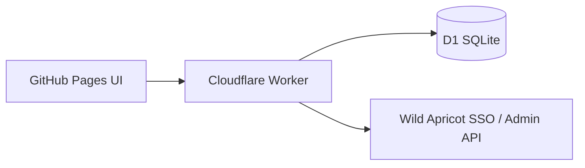

# Architecture

How the Walkathon step tracker is built and how its product rules work.

## System overview



| Layer | Location | Responsibility |
|-------|----------|----------------|
| Frontend | `index.html`, `src/app.js`, `styles.css` | UI, OAuth redirect handling, session in `sessionStorage` |
| API client | `src/api.prod.js` | Calls Worker with `?action=…` |
| Domain | `src/domain/` | Steps validation, date rules, aggregates, public names, membership gates |
| Worker | `worker/src/` | HTTP, CORS, rate limits, OAuth, D1, session HMAC |
| Data | Cloudflare D1 | One row per person per day; audit log for admin edits |

Local development uses the same domain logic with `src/mock/` + CSV (`npm run serve`) instead of the Worker.

## Product rules

### Club total

- Sum of all logged steps for all participants.
- Available without auth (`public_total`).
- Always shown in the hero.

### Personal total (“Your total”)

| Viewer | Club total | Your total |
|--------|------------|------------|
| Anonymous | Visible | Hidden |
| Signed in, not in Walkathon group | Visible | Hidden |
| Signed in, Walkathon participant (`canTrack`) | Visible | Visible |

`personalTotal` is the sum of that contact’s daily rows (all days). Returned on `me`, `log`, and `leaderboard` when `canTrack: true`. Never on `public_total`.

### Top-10 leaderboard

- Ranks by cumulative steps; UI shows at most 10.
- Response includes `participantCount` and `leaderboardLimit`.
- Caption “Top 10 of N participants” when `N > 10`.
- Club total still includes everyone, not only the top 10.
- Requires an **active** Wild Apricot membership (any group); Walkathon group is not required to *view*.

### Same-day logging (upsert)

Storage: D1 `PRIMARY KEY (date, contact_id)`.

```sql
INSERT INTO steps (...) VALUES (...)
ON CONFLICT(date, contact_id) DO UPDATE SET
  steps = excluded.steps, …
```

Saving 8,000 then 9,000 steps on the same calendar day → one row; totals use **9,000 only**.

Domain helper `dedupeDailyRows()` collapses duplicate `(date, contactId)` rows (latest `updated_at` wins) before aggregating — useful for CSV / import edge cases.

“Today” is the browser’s local calendar date (`YYYY-MM-DD`). Future dates are rejected.

### Public display names

Leaderboard and stored `name` fields use a privacy-safe form:

- First name + last-name prefix (e.g. `Alex R.`).
- Prefix lengthens until unique among people with the same first name (`Alex Ri.` / `Alex Re.`).
- Full last names stay in D1 (`first_name`, `last_name`) for disambiguation and are not returned to the browser.

Authenticated API responses expose a minimal member object only: `{ name, isAdmin? }`. Wild Apricot group membership is evaluated on the Worker and is not included in JSON responses or session tokens.

Logic: `src/domain/names.js`, `clientMemberView()` in `src/domain/membership.js`.

### Access control

| Capability | Requirement |
|------------|-------------|
| See club total | None |
| See leaderboard | Active WA member + session |
| Log steps / see personal total | Active + Walkathon allow-list (`ALLOWED_GROUP_IDS` / `ALLOWED_GROUP_NAMES`) |
| Admin edit steps | Active + admin allow-list (`ADMIN_GROUP_IDS` / `ADMIN_GROUP_NAMES`) |

Every gated action re-checks membership on the Worker from the session token plus a fresh Wild Apricot lookup (or cache). The frontend `isAdmin` flag and UI visibility are not trusted for authorization.

### Backend authorization gates

| Action | Session | Gate function | Purpose |
|--------|---------|---------------|---------|
| `public_config` | No | — | OAuth bootstrap only |
| `public_total` | No | — | Club total only |
| `auth_exchange` | OAuth code | `assertActiveMember` | Sign-in |
| `leaderboard` | Yes | `assertActiveMember` | Any active member may view |
| `me` | Yes | `assertAuthorizedMember` | Walkathon group required |
| `log` | Yes | `assertAuthorizedMember` | Walkathon group required |
| `admin_set_steps` | Yes | `assertAdminMember` | Admin group required |
| `admin_participant` | Yes | `assertAdminMember` | Admin group required |
| `admin_contributors` | Yes | `assertAdminMember` | Admin group required |
| `logout` | No | — | Client drops token |

`assertAuthorizedMember` = active membership + Walkathon allow-list. `assertAdminMember` = active membership + admin allow-list (fail closed when admin lists are empty). Track writes always use the authenticated member’s `contactId` from the session — never a client-supplied id.

If both allow-list env vars are empty for Walkathon, any **Active** member can log (dev convenience). In production, set the Walkathon group names/ids.

Group membership is loaded via the Wild Apricot Admin API when needed (`/contacts/me` often omits groups). Optional `WA_API_KEY` is preferred for that; otherwise the OAuth client credentials may be used.

### Admin

Admins see **Admin — edit participant steps** in the UI. Edits upsert the target’s day and write an `audit_log` row.

## Data model (D1)

**`steps`** — one row per participant per calendar day:

| Column | Notes |
|--------|--------|
| `date`, `contact_id` | Primary key |
| `email`, `name` | `name` is the public display form |
| `first_name`, `last_name` | Server-side; used for disambiguation |
| `steps` | 0…100000 |
| `updated_at`, `updated_by_*` | Audit of last writer |

**`audit_log`** — admin overrides (actor, target, old/new steps).

Schema: `worker/schema.sql`. Changes go in `worker/migrations/*.sql` and are applied by CI / `npm run worker:migrate`.

## Worker layout

| File | Role |
|------|------|
| `worker/src/index.js` | Fetch handler, CORS, client IP |
| `worker/src/handlers.js` | Action routing |
| `worker/src/db.js` | D1 queries |
| `worker/src/auth.js` | OAuth, sessions, membership refresh cache |
| `worker/src/cors.js` | Origin allow-list |
| `worker/src/rateLimit.js` | Per-IP limits on sensitive actions |
| `worker/src/config.js` | Env → config |

## API

Base URL: Worker origin. Query: `?action=<name>`.

| Action | Method | Auth | Notes |
|--------|--------|------|--------|
| `public_config` | GET | None | WA client id, account id, site URL for browser OAuth |
| `public_total` | GET | None | `{ totalSteps }` only |
| `auth_exchange` | POST | OAuth `code` + `redirect_uri` | Returns `sessionToken` + member |
| `leaderboard` | POST | Session | Top 10 + totals; personal total if `canTrack` |
| `me` | POST | Session + Walkathon | Day history, selected day steps |
| `log` | POST | Session + Walkathon | Upsert day; returns totals |
| `admin_set_steps` | POST | Session + admin | Upsert any contact/day |
| `admin_contributors` | POST | Session + admin | Full contributor list for picker |
| `logout` | POST | Session | Clears server-side expectations; client drops token |

Authenticated POSTs: body is `text/plain` JSON including `sessionToken` (simple CORS, no preflight). Public GETs need no credentials.

## Frontend config

`window.STEP_COUNTER_CONFIG` (from `config.js`):

| Key | Purpose |
|-----|---------|
| `MODE` | `local` or `prod` (Pages always forces prod) |
| `PART` | `all` \| `total` \| `leaderboard` \| `track` |
| `WORKER_URL` | Worker base URL |
| `WA_SITE_URL` | Club site (login links, etc.) |
| `JOIN_URL` | Walkathon event / join CTA |
| `TRACKING_START` / `TRACKING_END` | Inclusive YYYY-MM-DD challenge window (edit here; keep Worker `TRACKING_*` vars in sync) |

Never put WA client secrets in frontend config.

## Security notes

- OAuth client secret and `SESSION_SECRET` live only on the Worker.
- CORS restricted to configured frontend origin(s).
- Rate limits on auth, public total, log, and admin writes.
- Session tokens are HMAC-signed, expire (~7 days), and hold only `contactId`, public `name`, and `exp` — not group membership.
- Pages are `noindex` / `robots.txt` Disallow for club-only use.
