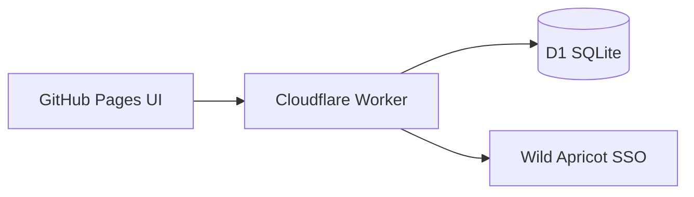
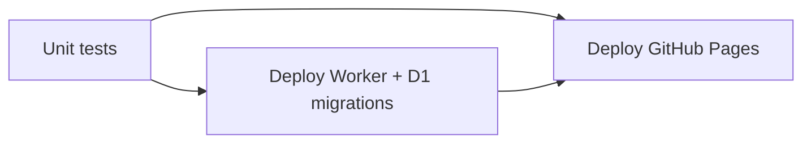

# Cloudflare Workers + D1 — migration plan

Transition from **Google Apps Script + Sheets** to **Cloudflare Workers + D1**. Wild Apricot SSO stays; the hosted UI gains a **top-10 leaderboard**, a **personal total** beside the club total (Walkathon participants only), and **same-day upserts** so re-logging replaces a day’s count instead of double-counting.

## Goals

| Goal | Target |
|------|--------|
| API latency | &lt; 500 ms typical |
| Cost | Workers Free + D1 Free — no credit card required |
| Auth | Wild Apricot SSO (OAuth secret on Worker) |
| Leaderboard | **Top 10** ranks; caption when more participants exist |
| Personal total | Shown **next to club total** when signed in **and** in Walkathon group |
| Daily logging | **One row per person per day** — upsert on conflict, never duplicate-add |
| Admin edits | In-app panel + CSV export/import |

## Product rules (locked for migration)

### Top-10 leaderboard

- SQL: `GROUP BY contact_id ORDER BY steps DESC LIMIT 10`
- Response includes `participantCount` (everyone with at least one logged day) and `leaderboardLimit: 10`
- UI caption: “Top 10 of N participants” when `N > 10`
- Club total still sums **all** participants, not just the top 10

### Personal total (hero)

| Viewer | Club total | Your total |
|--------|------------|------------|
| Anonymous | Visible | Hidden |
| Signed in, not in Walkathon group | Visible | Hidden |
| Signed in, Walkathon participant (`canTrack`) | Visible | Visible |

- `personalTotal` = `SUM(steps) WHERE contact_id = me` (all days, deduped by date)
- Returned on `me`, `log`, and `leaderboard` when `canTrack: true`
- Never exposed on `public_total` (no auth)

### Same-day upsert (no double-counting)

**Storage:** D1 `PRIMARY KEY (date, contact_id)`

```sql
INSERT INTO steps (...) VALUES (...)
ON CONFLICT(date, contact_id) DO UPDATE SET steps = excluded.steps, ...
```

**Domain:** `dedupeDailyRows()` collapses duplicate `(date, contactId)` rows (latest `updated_at` wins) before aggregating — defensive for CSV imports.

**Behaviour:** Saving 8,000 steps then 9,000 steps on the same calendar day → one row, club/personal totals include **9,000 only**.

## Architecture



Implementation lives in:

- `worker/src/index.js` — HTTP + CORS
- `worker/src/handlers.js` — action routing
- `worker/src/db.js` — D1 queries (upsert, top 10, totals)
- `worker/src/auth.js` — WA OAuth + session HMAC
- `worker/schema.sql` — migrations
- `src/domain/` — shared validation, dedupe, leaderboard helpers

## Deployment walkthrough (first time)

### Part A — Cloudflare account & database (≈15 min)

1. **Sign up** at [dash.cloudflare.com](https://dash.cloudflare.com) — choose **Workers Free** (no card).

2. **Install & log in** locally:
   ```bash
   cd ~/Repositories/step-counter
   npm install
   npx wrangler login
   ```
   Browser opens → approve access.

3. **Create D1 database:**
   ```bash
   npx wrangler d1 create step-counter
   ```
   Copy the `database_id` from the output.

4. **Commit the database id** — edit `wrangler.toml` and replace `REPLACE_WITH_D1_DATABASE_ID` with your id. This is not secret; Wrangler needs it in git for CI.

5. **Apply schema** (first time only):
   ```bash
   npm run worker:migrate
   ```

6. **Set Worker secrets** (one-time; stored on Cloudflare, not in git). Run each command and paste the value when prompted:
   ```bash
   npx wrangler secret put WA_CLIENT_ID
   npx wrangler secret put WA_CLIENT_SECRET
   npx wrangler secret put WA_ACCOUNT_ID
   npx wrangler secret put SESSION_SECRET      # openssl rand -hex 32
   npx wrangler secret put WA_SITE_URL         # https://www.aiwcduesseldorf.org
   npx wrangler secret put FRONTEND_ORIGIN     # your GitHub Pages URL, no trailing slash
   npx wrangler secret put WA_API_KEY            # optional but needed for group gates
   npx wrangler secret put ALLOWED_GROUP_NAMES   # e.g. Step Challenge
   npx wrangler secret put ADMIN_GROUP_NAMES     # e.g. Board
   ```

7. **Deploy the Worker manually once:**
   ```bash
   npm run worker:deploy
   ```
   Note the URL, e.g. `https://step-counter.<subdomain>.workers.dev`.

8. **Smoke test:**
   ```bash
   curl "https://step-counter.<you>.workers.dev?action=public_total"
   ```
   Expect `{"ok":true,"totalSteps":0}`.

### Part B — GitHub secrets (≈5 min)

In the repo → **Settings → Secrets and variables → Actions**, add:

| Secret | Value |
|--------|--------|
| `WORKER_URL` | Worker URL from step A7 |
| `WA_SITE_URL` | `https://www.aiwcduesseldorf.org` |
| `CLOUDFLARE_API_TOKEN` | See below |
| `CLOUDFLARE_ACCOUNT_ID` | Cloudflare dashboard → Workers → right sidebar |

**Create API token:** [dash.cloudflare.com/profile/api-tokens](https://dash.cloudflare.com/profile/api-tokens) → **Create Token** → use **Edit Cloudflare Workers** template → add **Account → D1 → Edit** → create. Copy token into `CLOUDFLARE_API_TOKEN`.

`FRONTEND_ORIGIN` on the Worker must match your **GitHub Pages URL** exactly (e.g. `https://you.github.io/step-counter`) — Wild Apricot OAuth redirect validation depends on it.

### Part C — Wild Apricot (one-time)

- Authorized app **Trusted redirect domain** = your GitHub Pages host (e.g. `you.github.io`).
- Redirect URI = your Pages URL (where users land after login), not the Worker URL.

### Part D — Push to deploy frontend

```bash
git push origin main
```

CI runs tests → deploys Worker (if Cloudflare secrets set) → deploys GitHub Pages with `WORKER_URL` baked into `config.js`.

Open your Pages URL → Connect club login → log steps → check leaderboard.

---

## Automated deployment (ongoing)

Every **push to `main`** (or **Actions → Run workflow**) runs `.github/workflows/deploy.yml`:



| What | Automated? | Trigger |
|------|------------|---------|
| Worker code deploy | Yes | Push to `main` (needs `CLOUDFLARE_*` secrets + real `database_id` in `wrangler.toml`) |
| D1 schema migrations | Yes | Same — runs `wrangler d1 migrations apply` before deploy |
| GitHub Pages frontend | Yes | Push to `main` (needs `WORKER_URL`, `WA_SITE_URL`) |
| Worker secrets | **No** — set once via `wrangler secret put` | Only re-run if you rotate credentials |
| WA OAuth app settings | **No** | Manual in Wild Apricot admin |

**After the first deploy**, day-to-day workflow is: change code → `git push` → CI handles the rest.

### Schema changes later

1. Add `worker/migrations/0002_whatever.sql`.
2. Push to `main` — CI applies new migrations automatically.

### Local Worker dev

```bash
cp .dev.vars.example .dev.vars   # fill in values
npm run worker:dev
```

Uses remote D1 by default when configured in `wrangler.toml`. Test at `http://localhost:8787?action=public_total`.

### Manual deploy (without waiting for CI)

```bash
npm run worker:migrate   # if schema changed
npm run worker:deploy
```

Pages still deploy via push to `main` unless you use GitHub Actions **workflow_dispatch** manually.

---

## Phase 0 — Cloudflare setup (checklist)

1. Create Cloudflare account (**Workers Free**, no payment method).
2. `npm install` && `npx wrangler login`
3. `npx wrangler d1 create step-counter` → paste `database_id` into `wrangler.toml`
4. `npm run worker:migrate`
5. `wrangler secret put …` (see Part A above)
6. `npm run worker:deploy`
7. GitHub secrets: `WORKER_URL`, `WA_SITE_URL`, `CLOUDFLARE_API_TOKEN`, `CLOUDFLARE_ACCOUNT_ID`
8. Push to `main`

## Phase 1 — API contract

| Action | Auth | Response highlights |
|--------|------|---------------------|
| `public_total` | None | `{ totalSteps }` only |
| `leaderboard` | Active member | `{ totals: { totalSteps, contributors[≤10], participantCount, leaderboardLimit }, personalTotal?, canTrack? }` |
| `me` / `log` | Walkathon group | `{ personalTotal, canTrack: true, history, ... }` |
| `admin_set_steps` | Admin group | Upsert any participant; `audit_log` row |
| `admin_contributors` | Admin | Full contributor list (admin picker) |
| `admin_export` / `admin_import` | Admin | CSV bulk edit (Phase 2) |

Frontend reads `WORKER_URL` (falls back to `APPS_SCRIPT_URL` during transition).

## Phase 2 — Data migration (Sheet → D1)

1. Export `steps` tab as CSV (`date,contactId,email,name,steps,updated_at`).
2. Import via `npm run worker:import -- data/export.csv` (script TBD) or `admin_import`.
3. **Dedupe on import:** if Sheet had duplicate `(date, contactId)`, keep latest `updated_at`.
4. Verify: club total matches; spot-check personal totals; leaderboard shows top 10.
5. Cut over GitHub Pages `WORKER_URL`; decommission Apps Script after soak period.

## Phase 3 — Manual data management

| Path | Use |
|------|-----|
| **In-app admin panel** | One-off fixes (already in UI) |
| **CSV export/import** | Bulk edit in Excel/Sheets; import upserts by `(date, contact_id)` |
| **Optional nightly Sheet sync** | Read-only export for admins who prefer grids; D1 remains source of truth |

## Phase 4 — Frontend (done in repo)

- Hero: club total + “Your total” side by side
- Leaderboard: top 10 + overflow caption
- CSP `connect-src` includes `https://*.workers.dev`

## Phase 5 — Observability

| Concern | Approach |
|---------|----------|
| Errors | Workers logs |
| Backups | Admin CSV export + D1 Time Travel (7 days free) |
| Audit | `audit_log` table for admin edits |

## Free-tier budget

Unchanged from prior estimate — club usage is well within Workers + D1 free limits.

## Rollback

Revert GitHub `WORKER_URL` → `APPS_SCRIPT_URL` and redeploy Pages. Sheet archive can re-seed Apps Script if needed.

## Decision log

| Decision | Choice |
|----------|--------|
| Backend | Cloudflare Worker + D1 |
| Leaderboard | Top 10 display; full club total |
| Personal total | Walkathon participants only, authenticated |
| Same-day re-log | D1 upsert + domain dedupe |
| Apps Script + Sheet | Deprecated after cutover |
