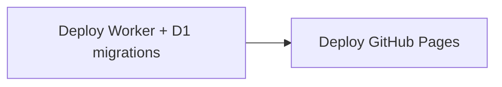

# Deploy & operations

First-time setup and ongoing deploys for the Walkathon step tracker.

## Prerequisites

- Node 22+
- Cloudflare account on **Workers Free** (no payment method required for typical club usage)
- Wild Apricot **server** authorized application with SSO enabled
- This GitHub repo with Pages + Actions enabled

---

## First-time setup

### 1. Cloudflare login & D1

```bash
npm install
npx wrangler login
npx wrangler d1 create step-counter
```

Put the returned `database_id` into `wrangler.toml` (replace any placeholder). The id is not secret; CI needs it in git.

```bash
npm run worker:migrate
```

### 2. Worker secrets

Set once (values are stored on Cloudflare, not in the repo):

```bash
npx wrangler secret put WA_CLIENT_ID
npx wrangler secret put WA_CLIENT_SECRET
npx wrangler secret put WA_ACCOUNT_ID
npx wrangler secret put SESSION_SECRET      # e.g. openssl rand -hex 32
npx wrangler secret put WA_SITE_URL         # https://www.aiwcduesseldorf.org
npx wrangler secret put FRONTEND_ORIGIN     # Pages origin, no trailing slash
# Recommended for group gates:
npx wrangler secret put WA_API_KEY
npx wrangler secret put ALLOWED_GROUP_NAMES # e.g. Step Challenge
npx wrangler secret put ADMIN_GROUP_NAMES   # e.g. Board
```

Optional: `ALLOWED_GROUP_IDS`, `ADMIN_GROUP_IDS`, `MEMBER_REFRESH_TTL_SEC` (default 900).

`FRONTEND_ORIGIN` must match the live site origin exactly (e.g. `https://you.github.io/step-tracker` or `https://walkathon.example.org`). CORS and OAuth redirect checks use it.

### 3. Deploy Worker once

```bash
npm run worker:deploy
```

Note the URL, e.g. `https://step-counter.<subdomain>.workers.dev`.

Smoke test:

```bash
curl "https://step-counter.<you>.workers.dev?action=public_total"
```

Expect `{"ok":true,"totalSteps":0}` (or current total).

### 4. Wild Apricot

In the authorized application:

- Enable SSO for users.
- **Trusted redirect domain** = GitHub Pages host (e.g. `you.github.io`) or custom domain host.
- Users return to the **Pages URL** after login (not the Worker URL).

### 5. GitHub Actions secrets

Repo → **Settings → Secrets and variables → Actions**:

| Secret | Value |
|--------|--------|
| `WORKER_URL` | Worker URL from step 3 |
| `WA_SITE_URL` | Club site origin |
| `CLOUDFLARE_API_TOKEN` | Token with Workers edit + D1 edit |
| `CLOUDFLARE_ACCOUNT_ID` | From Cloudflare dashboard |

Optional: `JOIN_URL` (Walkathon event page; CI has a default if unset).

**API token:** [Create Token](https://dash.cloudflare.com/profile/api-tokens) → **Edit Cloudflare Workers** template → add **Account → D1 → Edit**.

### 6. Push to go live

```bash
git push origin main
```

CI: unit tests → apply D1 migrations → deploy Worker → build `config.js` → deploy GitHub Pages.

Open the Pages URL → Connect club login → log a day → check leaderboard.

---

## Ongoing deploys

Every **push to `main`** (or **Actions → Run workflow**) runs `.github/workflows/deploy.yml` (Worker → Pages). Unit tests already ran on the merged PR.

**Pull requests** run unit tests via `.github/workflows/test.yml` (no deploy). Enable branch protection requiring the **Unit tests / Test** check before merge.



| What | Automated? | Trigger |
|------|------------|---------|
| Unit tests on PRs | Yes | Every pull request (`test.yml`) — merge blocker when branch protection enabled |
| Worker code deploy | Yes | Push to `main` (needs `CLOUDFLARE_*` secrets + real `database_id` in `wrangler.toml`) |
| D1 schema migrations | Yes | Same — runs `wrangler d1 migrations apply` before deploy |
| GitHub Pages frontend | Yes | Push to `main` (needs `WORKER_URL`, `WA_SITE_URL`) |
| Worker secrets | **No** — set once via `wrangler secret put` | Only re-run if you rotate credentials |
| WA OAuth app settings | **No** | Manual in Wild Apricot admin |

Day-to-day: change code → push → CI.

### Schema changes

1. Add `worker/migrations/000N_description.sql`.
2. Update `worker/schema.sql` to match (source of truth for greenfield installs).
3. Push to `main` — CI applies new migrations before Worker deploy.

### Manual Worker deploy

```bash
npm run worker:migrate   # if schema changed
npm run worker:deploy
```

Pages still need a push or workflow_dispatch unless you upload artifacts yourself.

---

## Local Worker development

```bash
cp .dev.vars.example .dev.vars   # fill secrets; never commit
npm run worker:dev
```

Hit `http://localhost:8787?action=public_total`.

For a full UI against a local Worker, set `config.js` to `MODE: 'prod'` and `WORKER_URL: 'http://localhost:8787'`, and set Worker `FRONTEND_ORIGIN` accordingly (e.g. `http://localhost:4173` if you also serve the static UI).

For UI-only mock data without WA/Cloudflare, use `npm run serve` (`MODE: 'local'`).

---

## Custom domain (optional)

To serve Pages at e.g. `walkathon.aiwcduesseldorf.org`:

1. DNS: CNAME `walkathon` → `MerlinDrews.github.io` (or your GitHub user/org Pages host).
2. Repo → **Settings → Pages → Custom domain** → enter the hostname → enable **Enforce HTTPS** when available.
3. Update Worker secret `FRONTEND_ORIGIN` to `https://walkathon.…` (no trailing slash).
4. Update Wild Apricot **Trusted redirect domain** to that host.
5. Update GitHub secret `WORKER_URL` only if the Worker URL changed (usually unchanged).

---

## Ops & backups

| Concern | Approach |
|---------|----------|
| Errors | Cloudflare Workers logs |
| Data restore | D1 Time Travel (free tier: short retention) |
| Admin audit | `audit_log` table |
| Free tier | Club-scale traffic fits Workers + D1 free limits |

---

## Checklist (first deploy)

1. Cloudflare account + `wrangler login`
2. D1 created; `database_id` in `wrangler.toml`
3. `npm run worker:migrate` + secrets + `npm run worker:deploy`
4. GitHub secrets set
5. WA trusted redirect domain = Pages host
6. Push `main` / confirm Actions green
7. Smoke: public total, Connect login, log steps, leaderboard, admin (if applicable)
